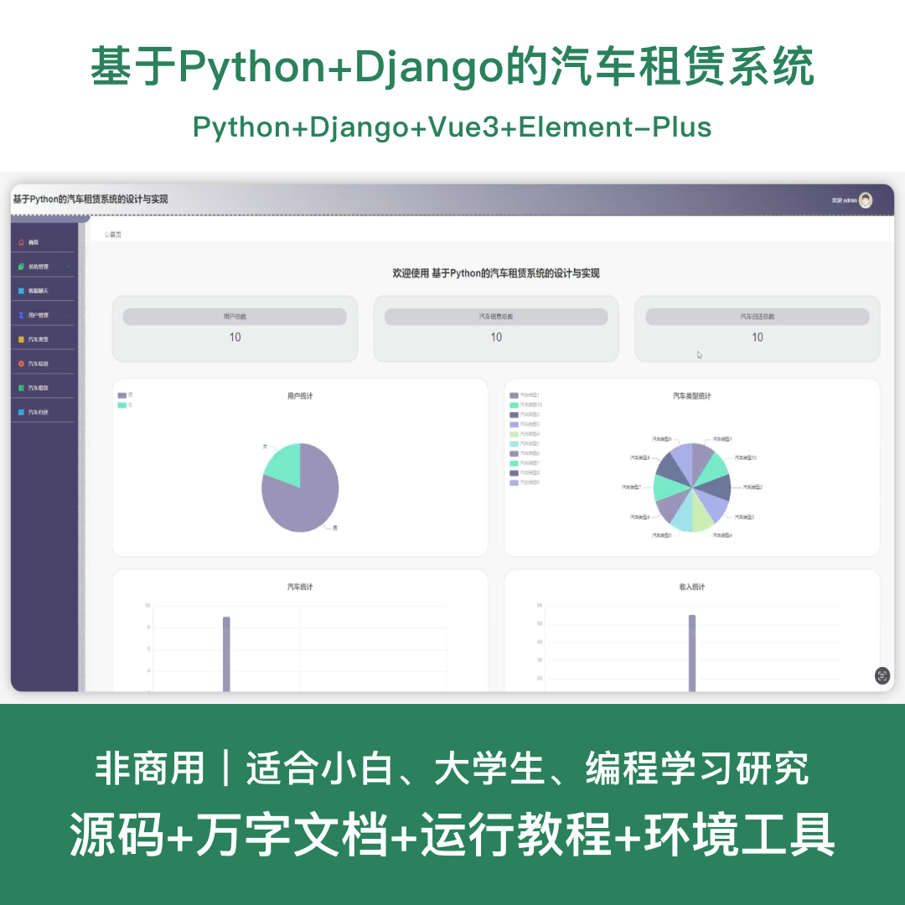
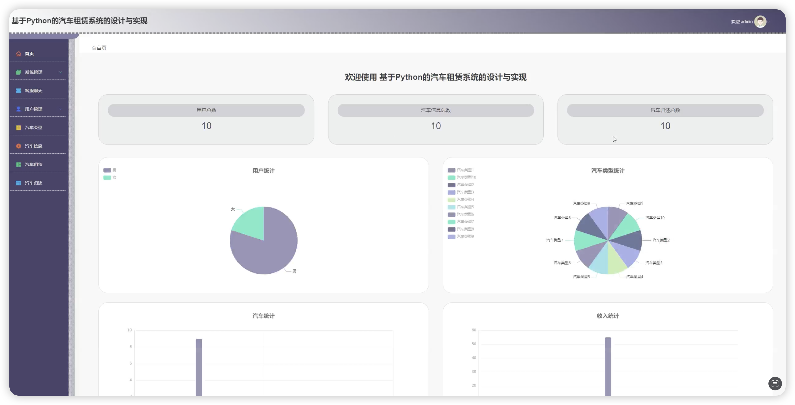
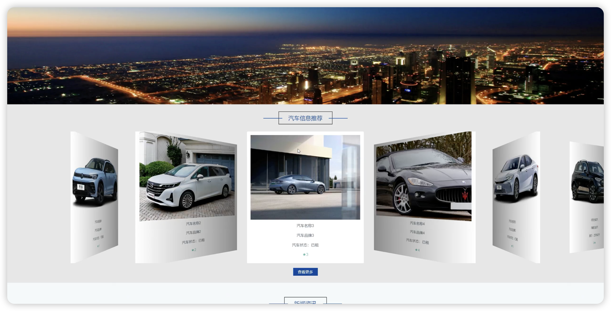
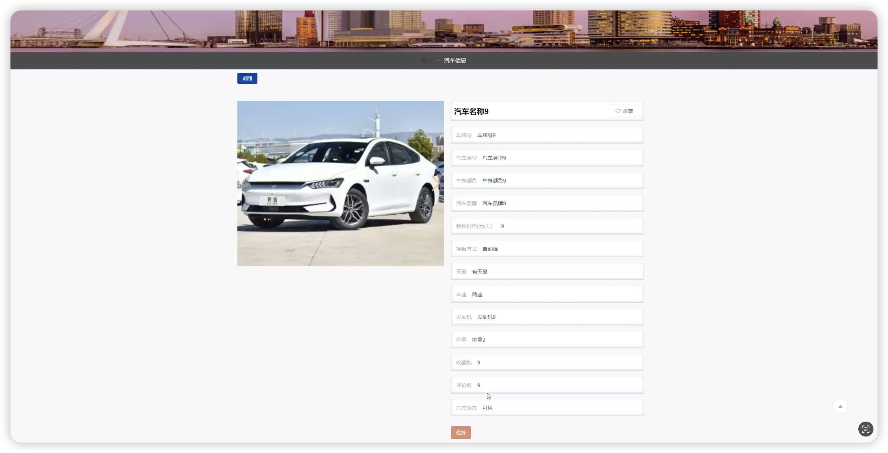
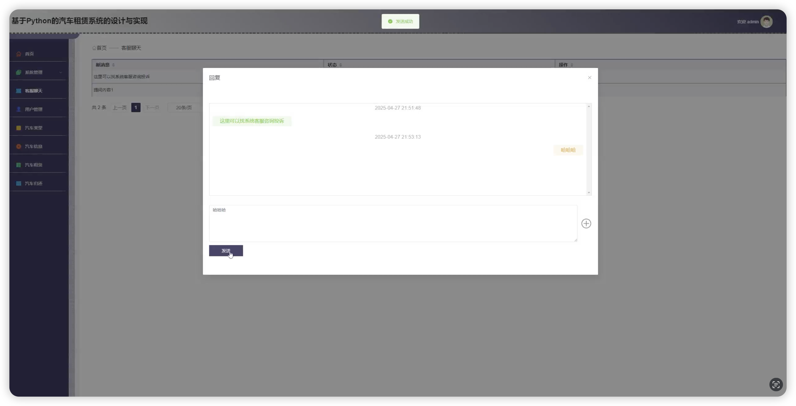
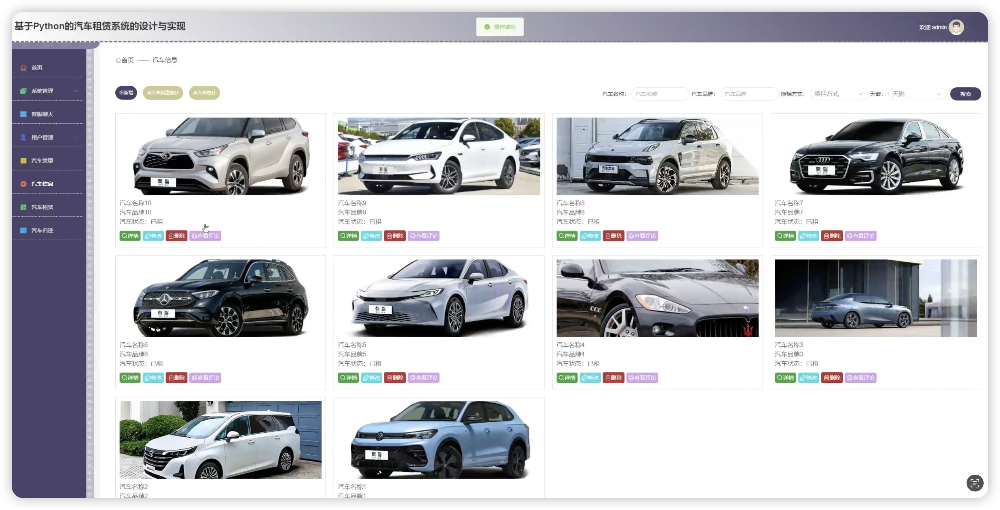
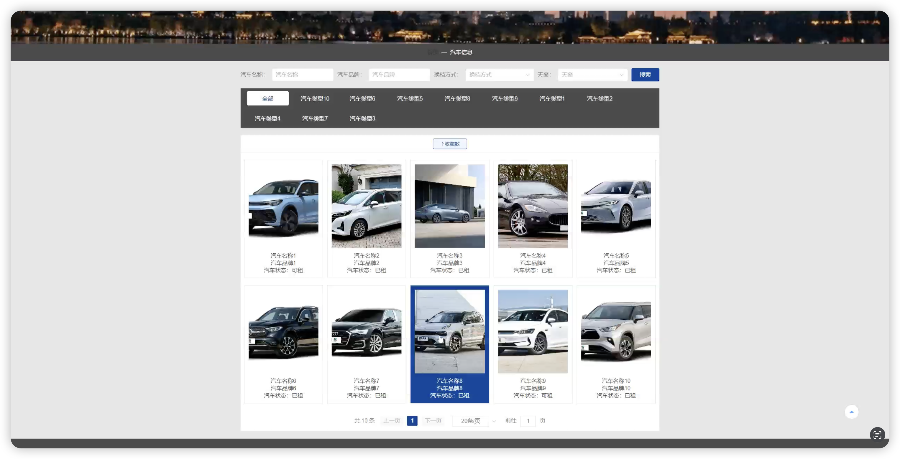
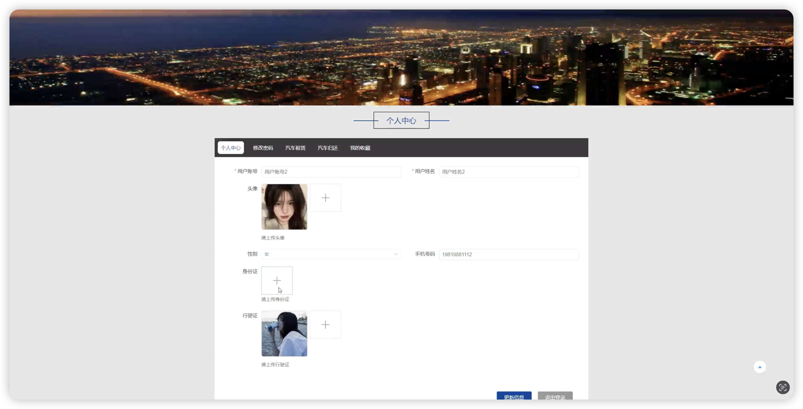
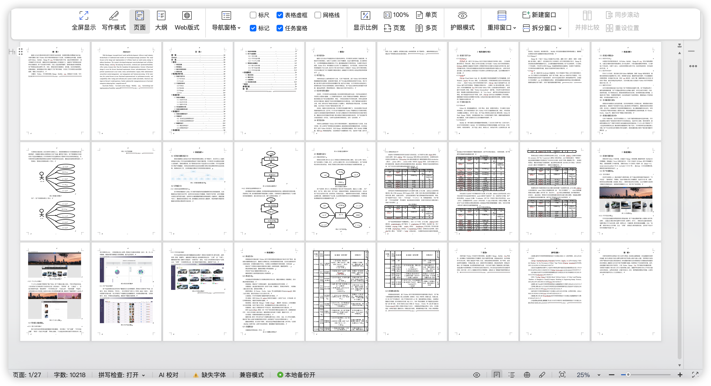

# python111D
python111D基于Python+Django的汽车租赁系统+LW
 
## 源码问题查看主页咨询

### 一、关键词
汽车租赁系统、租车系统、车辆租赁系统、汽车出租系统、车辆管理系统

### 二、作品包含
源码+数据库+万字设计文档+全套环境和工具资源+本地部署教程

### 三、项目技术
前端技术： Html、Css、Js、Vue3.2、Element-Plus
后端技术：Python、Django、PyMySQL

### 四、运行环境（以下版本亲测，其他版本兼容性请自行测试）
开发工具：PyCharm + VSCODE

数据库：MySQL 5.7+

数据库管理工具：Navicat10以上版本

环境配置软件： Python3.7+

前端Nodejs：16+

浏览器：谷歌浏览器

### 五、项目介绍
项目编号：python111D

基于Python+Django的汽车租赁系统，为用户提供便捷的汽车租赁服务，提升车辆管理效率和用户体验。

角色：管理员、用户

用户功能：注册登录、汽车信息查询、汽车预订、订单管理、个人信息管理、押金缴纳、汽车归还。

管理员功能：登录、用户管理、汽车信息管理、订单管理、车辆归还管理、押金管理、汽车类型管理。

数据库表：14张表

### 六、运行截图

